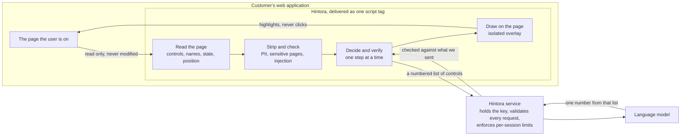
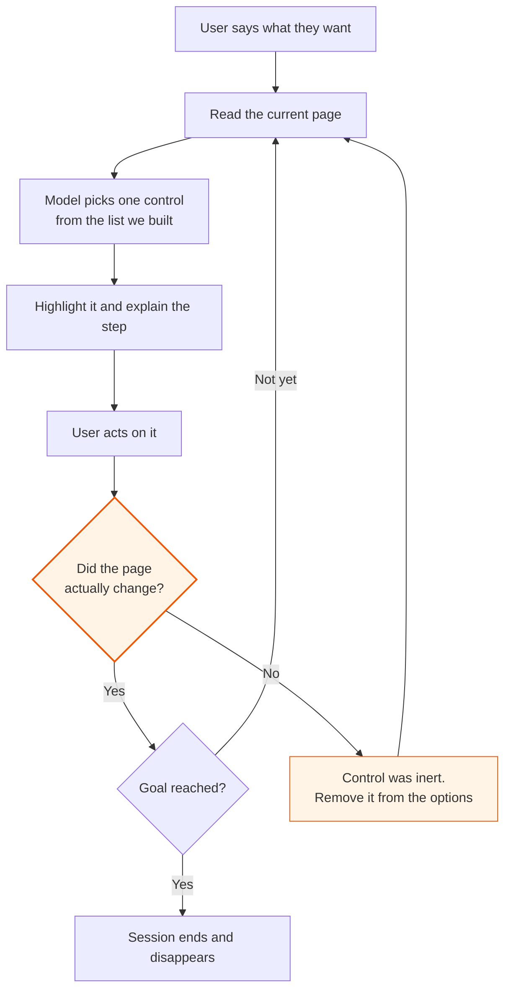
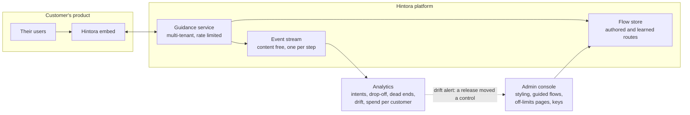

# Hintora

A browser-first guidance layer for SaaS products. A user types what they are trying
to do inside a web application, and the system reads the page they are looking at,
works out the next concrete action, and highlights the exact control to click. One
step at a time, on their real data, inside the product they already have open.

This is a proof of concept, and it is wired to a real model backend rather than a
scripted mock. Every step in the demo is a live call to an OpenAI model, and the
video shows it working end to end against a real page.

[Video walkthrough](TODO)

This document is about the decisions rather than the code. What I chose to build,
what I chose not to, why, and what the same system would need to become something a
software company could deploy to its customers.

---

## The problem I set out to solve

Most people do not fail to use software because it is missing a feature. They fail
because they cannot find the four clicks that feature is behind. The usual answers
are documentation nobody reads, a support ticket that costs the vendor money, or a
chatbot that explains those four clicks in words while the user looks at a screen
that does not match the description.

I decided the interesting product is not answering the question. It is closing the
gap between the answer and the screen. If the system can point at the actual control
on the actual page, the explanation stops being necessary.

That framing decided almost everything else.

---

## Reading the page: the DOM, not screenshots

The first real decision was how the system perceives the page. The fashionable
answer is screenshots and a vision model. I chose the DOM.

The browser already knows what every control is: its role, its accessible name, its
state, its exact position, and the region of the page it belongs to. Rendering that
to an image and asking a model to infer it back discards precise information in
exchange for a guess. It is slower, it costs more per step, and it degrades on
exactly the interfaces that matter, which are dense business applications full of
small repeated controls.

The DOM approach also produces something a screenshot cannot: an addressable handle
on the control. When the model picks one, I get a live element back and can measure
it, scroll to it and draw on it. That is what makes the guidance feel welded to the
page rather than approximately near it, and it is the difference between an
annotation that looks intentional and one that looks broken.

What actually reaches the model is not the page. It is a compact description of the
interactive controls on it, built in the browser: what each control is, what it is
called, which section of the page it sits in, and what state it is in. The layout,
the copy, the styling and the user's data are dropped before anything leaves the
browser.

---

## Guiding, not acting

The second decision was that the system points and never clicks.

An agent that operates the application on the user's behalf is a different product
with a different risk profile. It has to be trusted with irreversible actions inside
a system of record, and the first time it deletes the wrong thing the customer
removes it. It also fails quietly, because nobody was watching.

Guidance keeps the person in the loop by construction. Every action is theirs, so
the system cannot cause damage on its own, and the user learns their way around the
application instead of outsourcing it. For a B2B buyer that difference is the whole
procurement conversation: one of these needs a security review, the other needs a
script tag.

---

## How it fits together



Two things in that picture are load-bearing. The live elements of the page never
leave the browser: the service sees a list of controls and their labels, never the
document, never the user's data, and never anything it could act on. And the arrow
coming back from the model carries a number, not an instruction, which is the fence
described in the next section.

---

## Keeping the model inside a fence

The model is never asked to produce a selector, a command to run, or a name of its
own invention. It is handed a numbered list of controls that I built from the page,
and its answer has to be one of those numbers.

This is the most important design choice in the system, because it makes the
security property structural instead of defensive. The model's entire output space
is a set of controls that were already on the page and already the user's to click.
Even a completely successful prompt injection can, at most, point at a different
real button. It cannot exfiltrate anything, navigate anywhere, run anything, or
invent a control that does not exist.

Everything else I added, and I did add more, is defence in depth rather than the
defence. That distinction is what I would lead with in front of a buyer's security
team, because it is the difference between "we filter the bad inputs" and "the bad
input has nowhere to go".

---

## One step at a time, and no invented plans

I deliberately did not build a planner. The system never produces "here are the five
steps". It answers one question: given this page and this goal, what is the single
next action.

A plan requires predicting pages the system has not seen yet. Those predictions are
confident and often wrong, and a wrong third step poisons everything after it.
Asking again after each step costs slightly more and is right far more often,
because every answer is grounded in a page that actually exists.

The visible consequence is that the step counter says "Step 2" and never "Step 2 of
4". I do not know the total, and inventing one so the interface feels more finished
would be a small lie told to the user for cosmetic reasons.

---

## Knowing whether a step actually worked

I expected this to be simple. It was not, and it is the part of the system I am
most pleased with.

A click is what the user intended, not what the application did. Controls that do
nothing are everywhere in real software: half-built menus, buttons behind a
permission the user does not have, links the application swallows. Nothing about a
control tells you which kind it is before somebody presses it.

My first version assumed the click worked and moved on. That produced exactly the
failure you would expect. The user clicked a dead control, the system treated the
step as complete, asked again, got the same answer back, and looped.



The highlighted decision is the one that took me two attempts. The fix was to stop
treating the click as evidence and start treating the page as evidence. A step is only closed when the page actually changes. If nothing changes,
the system concludes the control was inert, takes it out of the options it offers,
and looks for another way through. Because I compose the list the model chooses
from, a dead end can be made unreachable rather than merely discouraged, which is a
stronger thing than asking a model politely not to repeat itself.

I also threw away my own first attempt at a fixed waiting period. There is no number
of milliseconds that is correct across software you have never seen: the same click
is instant in one application and a round trip to a server in the next. So the
system waits for the application to settle rather than for a clock, and any sign of
progress ends the wait immediately. Every web application has that property; no two
of them share a constant.

---

## Making it hold up over time

The question a buyer will actually ask is what happens when they ship a release
that moves a button.

Remembering where a control was, whether as a CSS path or a position on the page,
breaks the moment anything is rearranged, and it breaks silently by pointing at
whatever now occupies that spot. So the system remembers controls by description
instead: what the control is, what it is called, and which part of the page it
belongs to.

I built a small evaluation harness to check that rather than claim it. It takes
recorded pages, applies the kinds of changes a real application makes to its own
markup between releases, and compares my approach against the naive strategies a
scripted product usually ships. It also tries to break the system on purpose with
planted instructions.

Two results are worth stating plainly. When markup moves but the words stay the
same, which is the common case between releases, the description-based approach
finds the right control every time while a recorded path finds it about a third of
the time. And when a label itself is rewritten, my approach loses to a recorded
path, because a position does not care what a button is called and a description is
nothing but what it is called. I left that result in the suite rather than tuning it
away; it is what the smarter matcher on the roadmap exists to fix.

The number I care most about is not accuracy. It is how often a strategy points
confidently at the wrong control, because that is how a guidance product deletes
somebody's account. Mine never does that in these tests, and it reports a removed
control as gone rather than substituting something nearby. A miss shows the user a
sentence instead of a highlight, which is disappointing. A confident wrong answer
does damage.

---

## Why an SDK and not a browser extension

The pivot to B2B decides this. The buyer is the software company, not the end user.
A product that requires every one of their customers to install an extension has a
distribution problem the buyer cannot solve on their behalf, and they will not take
on a support burden with no lever to pull.

The embed is one script tag and a couple of attributes, which is the same install
shape their team already understands from analytics and support widgets. It also
puts the customer in control of what should be theirs: the accent colour, which of
their own buttons open the guide, and the suggested requests their users see first.

To be fair to the alternative, an extension is genuinely better at three things:
working across applications the customer does not own, surviving on pages the
customer cannot modify, and walking someone through a third-party tool where the
customer's script tag will never exist. That is a real market, just a different one.

I built the system so that choice stays open. The parts that understand the page and
run the guidance loop know nothing about how they were delivered, so an extension
would be a new entry point rather than a rewrite. This repository does not include
one.

---

## Why the ask surface is not a chat bubble

This is where I spent the most product thinking, because it is where every product
in this space ends up looking identical.

A card floating over the page is the shape of a conversation. That is why every
variant of it reads as a chatbot no matter which corner it is parked in: the form
carries the meaning, and the meaning is "talk to me". But guidance is not a
conversation. The job is "look here, then here", which is spatial. So the surface
should be an annotation drawn on the application rather than a container sitting
beside it.

In practice the page dims slightly, the target control stays bright, a numbered pin
attaches to it, and the sentence sits next to it with a line drawn back to the pin.
When the next step is elsewhere, the highlight travels there. Every completed step
leaves a faint marker behind, so by the end the user can see the route they walked
through their own application. The dimming is deliberately light, because the point
is to draw attention to a control, not to take the screen hostage.

How the user asks follows the same logic. It is a centred command bar on a keyboard
shortcut, or the customer's own Help button, and it is gone the moment it is
answered. At rest there is nothing on screen at all: no bubble, no launcher, no idle
prompt. A guide that is permanently visible competes for attention with the product
it is supposed to serve, and it starts to read as support rather than as capability.
The transience is the point. It should feel like a command palette, which users
already read as "the tool is listening", rather than a messenger, which reads as
"someone wants to chat".

One smaller decision turned out to matter more than I expected. When a step is on
screen, the user can say three different things rather than one: that they have
already done it, that this is not the right control, or that they want to stop.
Collapsing those into a single dismissal is what makes a guidance system repeat
itself, because it discards the only information that would let it answer
differently next time.

---

## Security and privacy decisions

Beyond the constrained output space above, there are four decisions I would defend
to a buyer's security team.

The system refuses to read certain pages at all. On anything carrying a password
field, or on a sign-in, checkout or payment path, nothing is read and nothing is
sent. It fails closed, because the cost of being wrong there is transmitting
somebody's credentials.

Personal data is stripped at a single boundary before anything leaves the browser,
and free text the user has typed into a field never leaves at all. There is exactly
one place in the system where page content becomes a network request, which is what
makes that claim auditable rather than aspirational.

The browser never holds an API key. It talks only to our own service, which holds
the key, validates everything it receives, and enforces spending limits per session,
because code running in someone else's browser cannot be trusted with either.

The guide is visually and technically isolated from the host application: the page
cannot restyle it or read it, and it cannot intercept clicks meant for the
application underneath. There is a related product rule that is really a safety
rule. A customer may retune the accent colour so the guide does not clash with their
palette, but may not make it look like their own interface. The user has to be able
to tell at a glance whether the product or the guide is speaking to them.

---

## Cost as a product constraint

Anything that runs on every session of every customer has to have its economics
designed rather than discovered.

The decisions were to use the cheapest capable model by default and escalate to a
stronger one only when an answer is actually bad, to bound the size of every request
regardless of how large the page is, to cap what a single session can spend and
enforce that on the server rather than in the browser, and to make sure a page that
updates on its own cannot quietly spend a session by itself. Every call is accounted
for from the first one rather than estimated afterwards, and the running total for a
session is available to the host application rather than reconstructed from logs
later.

I also chose the model family for reproducibility rather than for the last increment
of savings. Being able to reproduce a session exactly is how a wrong highlight gets
diagnosed and how any measurement of the system means anything. A slightly cheaper
option that randomises its own sampling would have cost me that, and I judged the
trade not worth taking.

---

## What a production B2B system needs

The demo shows the mechanism. A product a software company deploys to its own
customers needs four things this does not yet have.



The flow store is what makes the economics work. A request answered by a flow the
customer authored is deterministic and needs no inference; one answered by a route
learned from an earlier successful session needs none either; only genuinely new
ground reaches the model. Today only that last path exists, and the other two are a
design and a label in the interface.

### An admin console

Today the entire configuration is a few attributes on a script tag. A real customer
needs somewhere to define their own styling within the guardrails that keep the
guide recognisable as a separate thing, to author and version their own guided flows
for the requests their support team answers most often, to set the suggested intents
their users see, to mark pages and routes where the guide must stay off, and to
manage keys and environments.

This is also the commercial mechanism, not just an administrative convenience. An
authored flow is deterministic and needs no inference at all, so the console is how
a customer converts their support burden into guidance that gets cheaper the more
they use it.

### An analytics layer

The service already records a structured, content-free event for every step. What
belongs on top of it is the dashboard the customer actually wants: which requests
users make most, which succeed and where they abandon, which pages generate the most
dead ends, how often the system has to fall back to the stronger model, and
inference spend per customer with alerting and hard caps.

One signal matters more than the rest. A rising rate of controls the system can no
longer find means the customer shipped a release that moved something, and catching
that before their users do is the difference between a guidance product that decays
quietly and one that is maintained.

### Learned flows

A session that succeeded is a route through the application, and that route can be
replayed for the next user who asks the same thing. This is where cost stops scaling
linearly with usage, and where the product starts feeling instant rather than
thoughtful.

### Platform

Multi-tenancy, authentication, per-customer rate limits, persistence so sessions and
spending limits survive a restart, and the compliance surface a SaaS buyer raises on
the first call, including the option to route inference through their own provider
account.

Past those four, the work I would pick up next is a smarter matcher so a renamed
button degrades into a ranked guess rather than a miss, support for pages built out
of embedded frames, and accessibility work so a whole guided session can be
completed from the keyboard. That last one matters more here than in most products,
because the people most likely to need step-by-step guidance overlap heavily with
the people navigating by keyboard.

---

## What this demo is deliberately not

There is no browser extension, no multi-tenancy, no authentication and no
persistence: session limits live in memory and reset when the service restarts. Only
the live inference path is built, so the authored and learned flows described above
exist as a design and as a label in the interface rather than as working features.
The system does not see inside embedded frames or into applications drawn on a
canvas. The classifier that decides an action is destructive reads the control's
label, so it will miss an unlabelled icon button, which is exactly why the interface
asks the user to confirm rather than trusting it. The evaluation runs against saved
pages rather than live third-party applications, so those numbers are directional
rather than a benchmark. The visual layer is verified by hand in a browser rather
than by automated visual tests.

None of that is hidden anywhere. The point of the demo is to show an approach, a
product direction, and the reasoning behind both.

---

## Running it

Node 20.11 or newer, and an OpenAI API key.

```bash
cp .env.example .env  # add your OpenAI API key
npm install
npm run dev:all
```

Open http://localhost:5173, press Ctrl+K or use the demo application's own Help
button, and try "change my notification email", "export my contacts", or "how do I
delete my account".

`npm test` runs the unit suite and `npm run eval` runs the reliability and red team
comparison described above.
